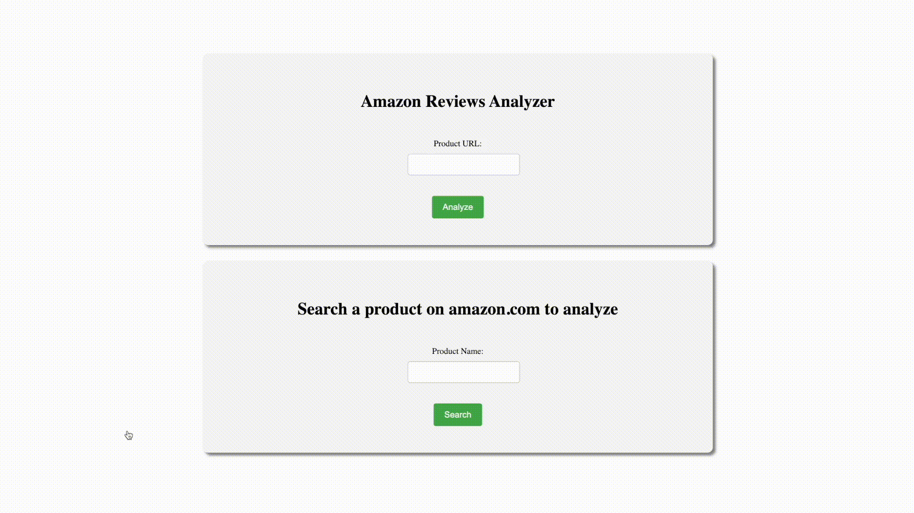
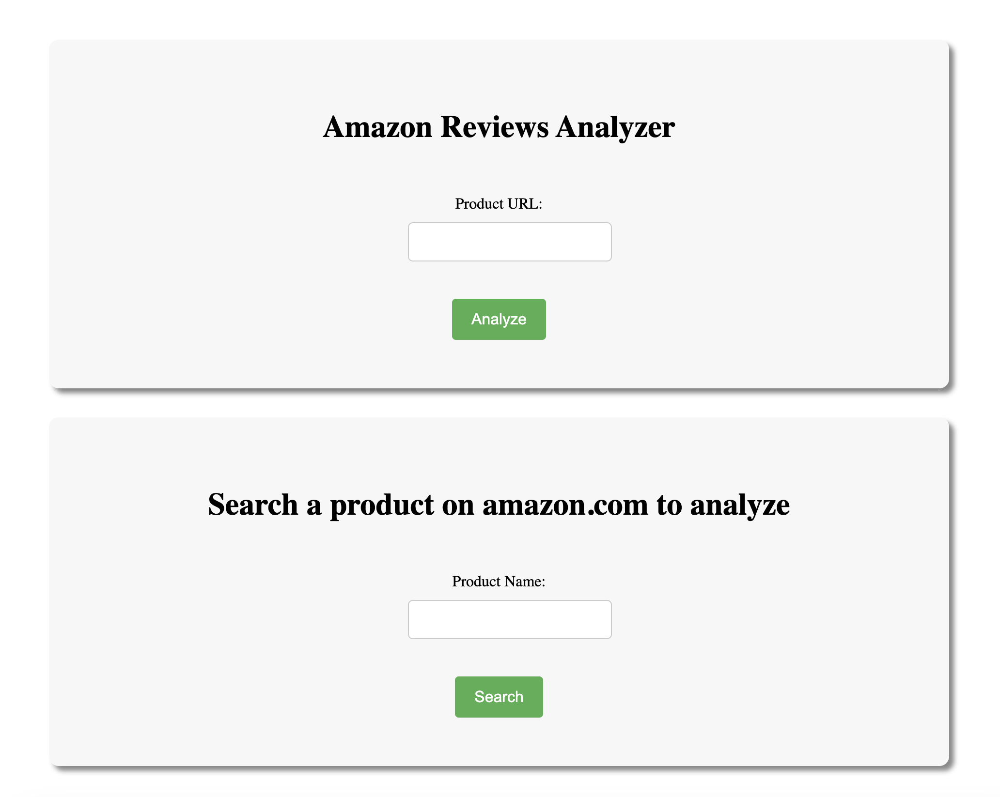
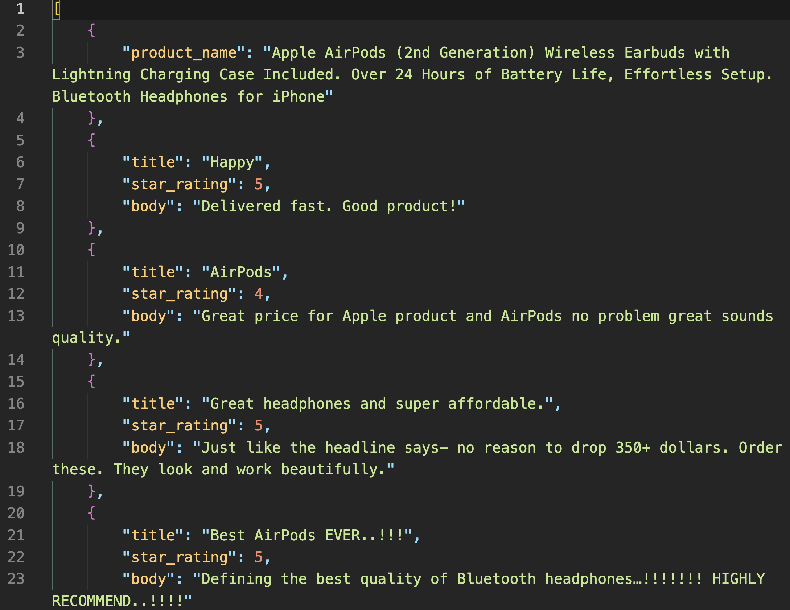
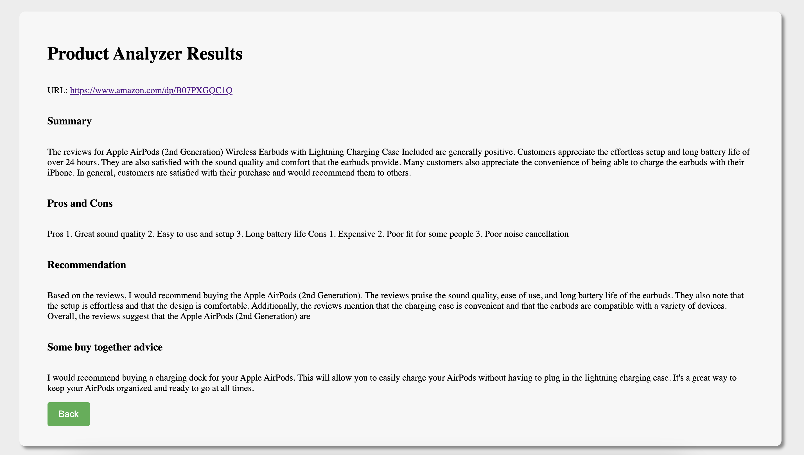

# Amazon Reviews Analyzer
<h3 align="center">EN 601.666 Information Retrieval and Web Agents (Spring 2023)</h3>
<h4 align="center">Xiaorui (Ray) Zhang</h4>
<h4 align="center">Johns Hopkins University</h4>
<p align="center">
  
</p>

## Abstract
This project aims to develop a web interface that allows users to search for any product on Amazon and scrape all its reviews. Using OpenAI's GPT-3 API, the system summarizes the reviews, and suggests buy-together items.
## Project Description

This project offers users two options for analyzing Amazon product reviews. The first option involves providing the system with a specific Amazon product URL, while the second option involves searching for a product using the project's web interface.



Once the user enters their query, the system searches Amazon.com and scrapes the search results, which are then organized by product rating and presented to the user in a layout similar to Amazon.com.


The user can then select a product to analyze, at which point the system scrapes both the product description and all reviews on the product's review page. The reviews are categorized into review title, review body,and product rating and saved in a local JSON file for future reference.



The system also sends the reviews to ChatGPT for analysis, which includes summarizing the reviews, listing three pros and cons of the product, providing a recommendation on whether to buy the product, and suggesting other products that are often bought together with it.



For url to this product please see the last section. Please note that due to the potential for products on Amazon to have thousands of reviews, the system currently limits scraping to the first two pages (sorted by the most recent) by default, using the max pages parameter when instantiating the scraper object in app.py 
```
scraper = amz_scraper.AmazonReviewScraper(product_asin, max_pages=2)
```
Users can
adjust this parameter to include more reviews if desired.

## How to run the project on your machine:

-   Amazon blocks direct HTML requests by response = requests.get(url).To bypass this restriction, the project uses the Splash Docker image to virtually render the HTML file. Splash is a lightweight browser with an API designed specifically for web scraping and rendering JavaScript and dynamic websites. You can quickly install Splash using Docker by following the instructions at
    <https://splash.readthedocs.io/en/stable/install.html>.

-   You can create a Conda environment quickly with the provided requirements.txt file. Simply run the command:
```
conda create --name amz-rev-analyzer --file requirements.txt
```

-   Get the docker image running.

-   Activate the Conda environment amz-rev-analyzer and navigate to the project's root directory.

-   Run the app by executing the command 
```
python app.py
```

-   Open up your browser and go to http://localhost:4994/. You may want to change port if 4994 is blocked.

## Selling Points/Achievements:

-   **Ease of use**: 
  The web interface provides a simple and intuitive way for users to search for products and analyze heir reviews. Users can choose to enter a URL or search for a product on Amazon.com using the search bar.

-   **Comprehensive analysis**: 
  The system categorizes each review into title, body, and rating, and sends them to ChatGPT for analysis. ChatGPT provides a summary of all the reviews, lists three pros and three cons of the product, gives a recommendation on whether the user should buy the product, and suggests other products that are often purchased together to make shopping easier.

-   **Customizability and Scalability:**
  The system is designed to handle a large amount of data and can analyze reviews for any product on Amazon.com. Users can tailor their search results by sorting the products by rating and displaying them in a layout similar to Amazon.com, making it easier to find the products that best fit their needs. Furthermore, the system's infrastructure allows for easy customization of responses from ChatGPT. For example, after a discussion with the professor, the buy-together recommendation feature was added with just one prompt to ChatGPT. This demonstrates the system's scalability and flexibility in adding new custom tasks for ChatGPT to perform. With its ease of use and ability to accommodate a wide range of user needs, the system has the potential to become an useful tool for online shopping.

-   **Data organization**: 
  The system organizes the scraped data into a JSON file for local reference, making it easy for users to keep track of their previous searches and analyses.

-   **Scope**: 
  The project covers a wide range of products and allows users to analyze the reviews for any product on Amazon.com.

-   **Success**: 
  The project has been successful in achieving its goals of providing a comprehensive analysis of products through customer reviews and offering valuable insights to potential buyers.

## Limitations and Potential Improvements

### Limitation:

-   The system currently only works for analyzing product reviews on Amazon.com and cannot be used for other e-commerce websites.

-   The system's analysis of reviews is limited to the text of the reviews themselves and does not take into account other factors such as the reviewer's demographics or the product's sales data.

-   The system relies on the accuracy and completeness of the data scraped from Amazon.com, which can be subject to change or inaccuracies over time.

### Potential Improvements:

-   Expand the system to work with other e-commerce websites, allowing users to analyze reviews for a wider range of products.

-   Implement a more robust data scraping and cleaning process to improve the accuracy and completeness of the data collected from Amazon.com. This could include expanding the data collected beyond reviews to include information such as delivery times, potential discounts, and other product details. Additionally, implementing automated product analysis for similar products could provide users with more comprehensive and comparative information when making purchasing decisions.

-   Explore additional tasks that ChatGPT could assist with, taking into account the strengths and weaknesses of the model for different types of analysis. For example, ChatGPT may excel at summarizing large amounts of text, but may not be as effective at providing nuanced product recommendations. Identifying the strengths and limitations of the model for different types of tasks can help guide future development and ensure the system is providing the most valuable insights to users.

## Additional Examples/ system testing

To thoroughly test the system's capabilities, we analyzed products from various categories with both positive and negative ratings, including electronics (Apple headphones with a good rating), kitchen utensils (ceramic grater with a good rating), pet supplies (dog ball with a good rating), clothing (T-shirt with a medium rating), furniture (standing desk with a medium rating), and fresh produce (apples with a bad rating). P.S, all detailed examples can be found in "examples" folder, and each product that have been analyzed is linked below.

### Electronics: [Apple Headphones](https://www.amazon.com/Apple-AirPods-Charging-Latest-Model/product-reviews/B07PXGQC1Q/ref=cm_cr_arp_d_viewopt_srt?ie=UTF8&reviewerType=all_reviews&sortBy=recent&pageNumber=1)

Please see the first section.

### Kitchen Utensils: [Ceramic Grater](https://www.amazon.com/Kyocera-Ceramic-Grater-Medium-Ginger/product-reviews/B0002B15DS/ref=cm_cr_arp_d_viewopt_srt?sortBy=recent&pageNumber=1)


### Pet Supplies: [Dog Ball ](https://www.amazon.com/Chuckit-Small-Ultra-Ball-2-Pack/product-reviews/B00280MUVC/ref=cm_cr_arp_d_viewopt_srt?ie=UTF8&reviewerType=all_reviews&sortBy=recent&pageNumber=1)


### Clothing: [T-shirt](https://www.amazon.com/CTU-Fashion-Athletic-T-Shirts-Workout/product-reviews/B0B5FZNQ29/ref=cm_cr_arp_d_viewopt_srt?ie=UTF8&reviewerType=all_reviews&sortBy=recent&pageNumber=1)


### Furniture: [Standing Desk](https://www.amazon.com/AIZ-Standing-Adjustable-Computer-Workstation/product-reviews/B094G8P5QS/ref=cm_cr_arp_d_viewopt_srt?ie=UTF8&reviewerType=all_reviews&sortBy=recent&pageNumber=1)


### Fruits: [Fresh apples](https://www.amazon.com/APPLES-FRESH-PRODUCE-FRUIT-POUND/product-reviews/B019TKF2AY/ref=cm_cr_arp_d_viewopt_srt?ie=UTF8&reviewerType=all_reviews&sortBy=recent&pageNumber=1)


